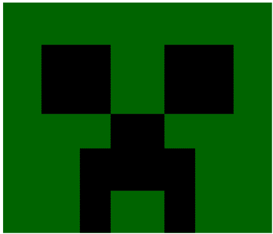

# Creeper

- Crear un nuevo archivo, por ejemplo creeper.html;
- Definir la etiqueta (*tag*) `<canvas> </canvas>`
- Crear un script usando los objetos `pantalla` y `pincel`
- Diseñar los rectángulos a través de la función `fillRect` del **pincel**
- No olvides pintar los rectángulos, aquí usamos los colores **darkgreen** y **black**

Para facilitar un poco, las dimensiones de nuestros rectángulos (base x altura) en pixeles es el siguiente:

- Rectángulo 1: 350, 300 (cabeza).
- Rectángulos 2 y 3: 90, 90 (ojos).
- Rectángulo 4: 70, 100 (nariz).
- Rectángulos 5 y 6: 40, 110 (parte de la boca). ***Su canvas debe tener el tamaño de 600 x 400 pixeles***.
