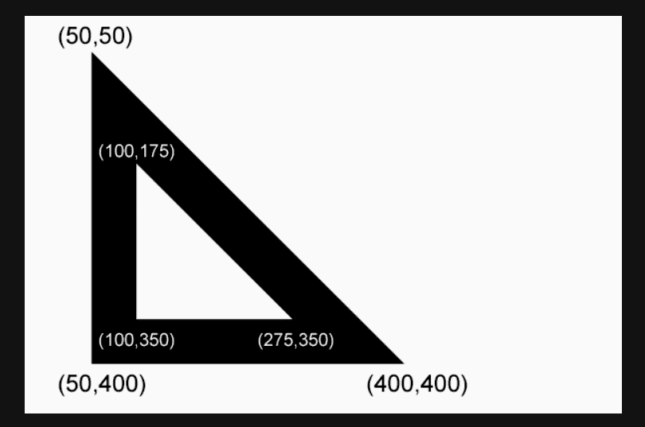

# Escuadra

Hora de diseñar otra figura. En este nuevo desafío vamos a diseñar una escuadra (plantilla especial en forma de un triángulo isósceles usada por arquitectos e ingenieros).

Si analizamos la figura podemos ver un triángulo dentro de otro. Recordando también que diseñar triángulos es diferente, pues es preciso diseñar línea por línea.

Usa las funciones `beginPath(), moveTo(), lineTo() y fill()`.

Ahora es tu turno de crear un nuevo archivo (**escuadra.html**) y diseña una escuadra con las coordenadas de la imagen de arriba.
